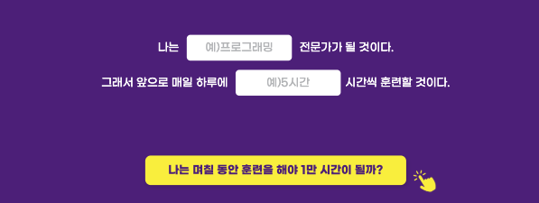
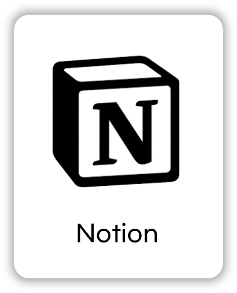

# The_10000-hour-rule
> _1만 시간의 법칙_
> "어떤 분야의 전문가가 되기 위해서는 최소한 1만 시간의 훈련이 필요하다."는 말을 바탕으로 한 자기계발 웹페이지입니다.
 

---

## 배포 URL
[https://nguswjd.github.io/The_10000-hour_rule/]
 

---

## 화면 구성
|1만 시간의 법칙 소개|
|:---:|
||
|1만 시간의 법칙에 대한 개념을 소개합니다.|

|사용자 목표 입력 폼|
|:---:|
||
|사용자의 희망 직업과 하루 훈련 시간을 입력하면,  결과 출력 화면에 해당 내용을 보여줍니다.|

|결과 출력|
|:---:|
||
|사용자의 희망 직업과 하루 훈련 시간에 따라 1만 시간을 달성하기 위한  일수를 계산해 줍니다. (현재는 계산 기능을 위한  JavaScript 코드가 구현되지 않은 상태입니다.)|

|광고 배너|
|:---:|
||
|사용자가 '훈련하러 가기' 링크를 클릭하면, '훈련 바로가기' 광고 배너가  열립니다. (JavaScript 구현이 완료되지 않아 현재는  `.sr-only` 클래스를 통해 비활성화되어 있으며,  시각적으로는 응원 메시지와 '훈련하러 가기' 링크가 포함되어 있습니다.)|
 

---

## 기술 스택
### Front-end

  
  

### Tools

  
  

 

---

## 프로젝트 구조
📦The_10000-hour_rule  
┣ 📂image  
┣ 📂readme-image  
┣ 📜README.md  
┣ 📜index.html  
┣ 📜reset.css  
┗ 📜style.css  
 

### 📂image
- `title.png`  
  : 페이지 상단에 표시되는 **1만 시간의 법칙 로고** 이미지입니다.
- `“.png`, `”.png`  
  : 1만 시간의 법칙의 정의를 감싸는 **열림/닫힘 따옴표** 이미지입니다.
- `click-icon.png`  
  : "나는 며칠 동안 훈련해야 할까?" 버튼 옆에 표시되는 **버튼 클릭 아이콘** 이미지입니다.
- `weniv-logo.png`  
  : 하단 푸터에 표시되는 **위니브 로고** 이미지입니다.
- `liket-img.png`  
  : 광고 배너에 등장하는 **응원 캐릭터 라이캣** 이미지입니다.
 

### 주요 클래스 및 ID 설명
| 이름            | 종류  | 설명 |
|----------------|-------|------|
| `.logo`        | class | 헤더 로고 이미지에 사용되는 클래스 |
| `.definition`  | class | '1만 시간의 법칙' 설명 섹션 |
| `.goal-survey` | class | 사용자가 목표를 입력하는 설문 폼 |
| `#job`         | id    | 희망 직업을 입력받는 인풋 필드 |
| `#hour`        | id    | 하루 훈련 시간을 입력받는 인풋 필드 |
| `.result-box`  | class | 결과 문장에서 동적으로 강조되는 부분 |
| `.link-share`  | class | 훈련/공유 버튼을 포함하는 네비게이션 영역 |
| `.sr-only`     | class | 화면에는 보이지 않지만 스크린리더에는 보이는 접근성 클래스 |
 

---

## 개선 예정 사항
- JavaScript를 통한 계산 기능 구현
- 링크 이동 url 수정 (배너에 연결된 링크 포함)
- 사용자 목표 입력 폼의 데이터 저장 방식 추가
